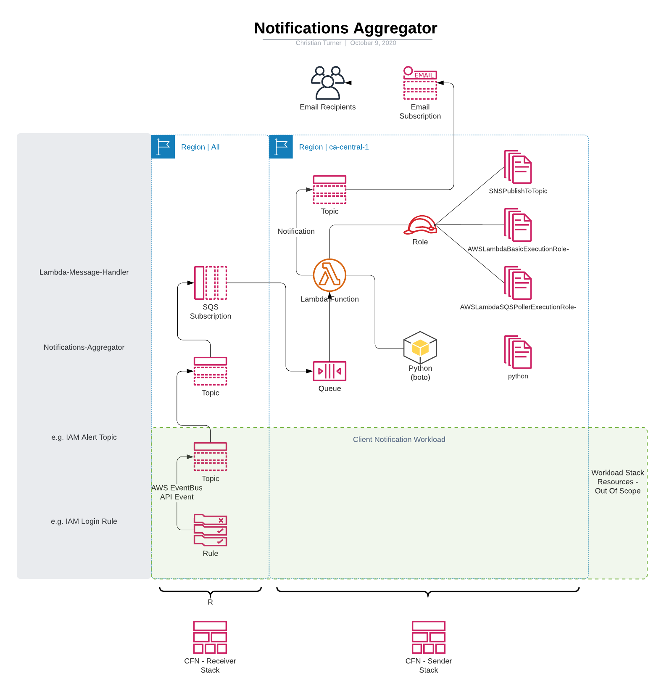
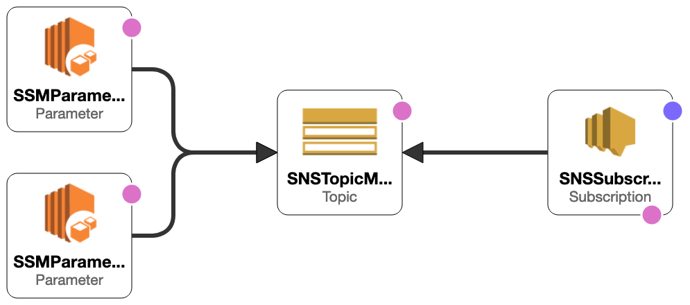
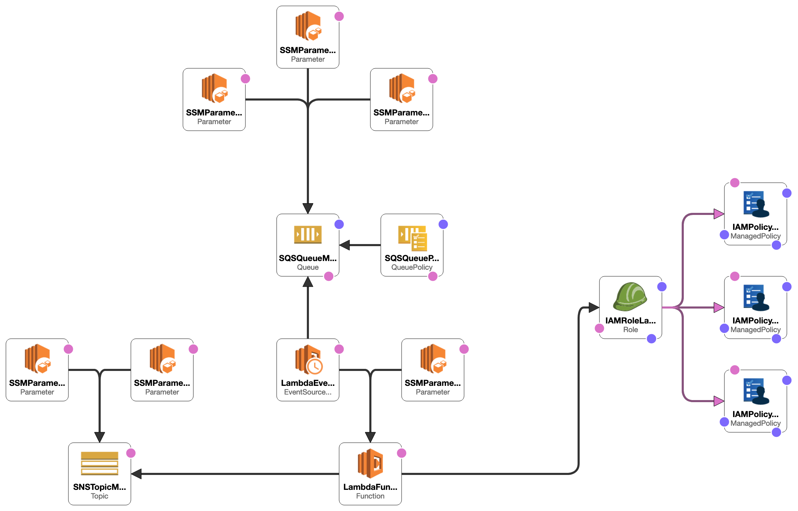
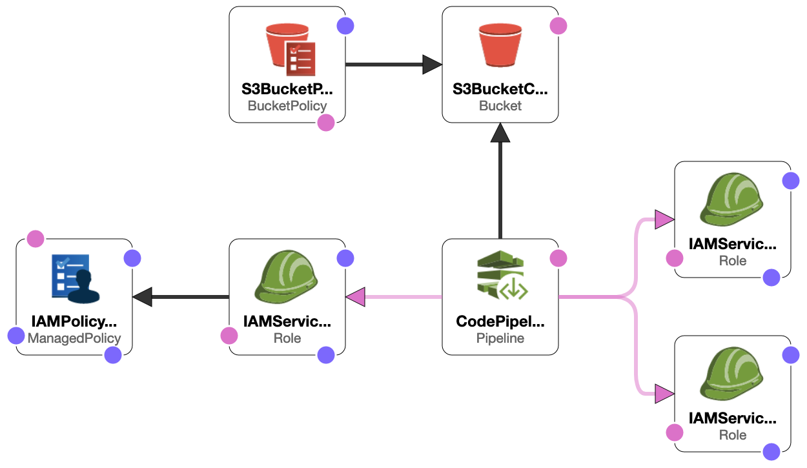

# SNS Aggregator

- [SNS Aggregator](#sns-aggregator)
  - [Overview](#overview)
  - [Architectural Design](#architectural-design)
    - [CloudFormation Design](#cloudformation-design)
      - [sns-aggregator-all-regions | Receiver](#sns-aggregator-all-regions--receiver)
      - [sns-aggregator-primary-region | Sender Stack](#sns-aggregator-primary-region--sender-stack)
      - [CodePipeline Stack](#codepipeline-stack)
  - [Deployment](#deployment)
    - [Step 1: Configure Deployment Targets](#step-1-configure-deployment-targets)
    - [Step 2: Configure Sender Queue](#step-2-configure-sender-queue)
  - [Appendix A: List Organization Units](#appendix-a-list-organization-units)
  - [Appendix B: Known Issues](#appendix-b-known-issues)
    - [Deploying as a standalone](#deploying-as-a-standalone)
  - [Future Enhancements](#future-enhancements)

## Overview

The SNS Aggregator is a bespoke solution that is implemented to overcome the limitation of working with regional event driven notifications in AWS.  AWS SNS Notifications are frequently mapped with Lambda Functions to provide event driven notifications, but as a limitation both the SNS Topic and the Lambda Function (or Event Rule and other services) must be within the same AWS Region.

Multiple SNS Topics that are created from automation templates (CloudFormation, Terraform, etc.) as standalone solutions frequently end up creating duplicate subscriptions, including spawning the dreaded million-click-through subscription nightmare!

This solution mitigates the issue of creating multiple Topics with multiple subscriptions, with a consolidated notification proceess, by integrating regional streams, and standardising naming conventions to enable parameterised integration, as well as Parameter Store exported reference points, and CloudFormation Exports.

## Architectural Design

To facilitate initiation of alerts, we deploy SNS Topics within each region that.  Each SNS Topic is subscribed to a centralised SQS Queue within the primary region. 



### CloudFormation Design

The CloudFormation Template design has been split into two templates;

+ sns-aggregator-all-regions
+ sns-aggregator-primary-region

#### sns-aggregator-all-regions | Receiver

To permit SNS Topics to forward notifications across regions, we deploy an SQS Message Queue within each desired region, attach an SQS Queue Policy, and export the SQS resource via CloudFormation Exports and SSM Parameter Store entries.



#### sns-aggregator-primary-region | Sender Stack

The Message Aggregator consists of Lambda Function, that executes a Python 3.7 script agains an inbound trigger from any of the SQS Queus.  The Lambda Function then sends the JSON of the SQS record to the outbound SNS Topic.



These components comprise the 'Sender Stack', with CloudFormation Exports and Parameter Store entries created to easily enable additional IaC automation, including CloudFormation and TerraForm. You can reference the outputs to apply subscriptions to the Sender Topic in addition to manually using the GUI.

| Resource | CloudFormation | Parameter Store |
| --- | --- | --- |
| SNSTopicMessageAggregator | !ImportValue SNSTopic-MessageAggregator | '{{resolve:ssm:/default/snstopic-messageaggregatorarn:1}}' |
| SNSTopicMessageAggregatorName | !ImportValue SNSTopic-MessageAggregatorName | '{{resolve:ssm:/default/snstopic-messageaggregatorname:1}}' |

#### CodePipeline Stack

The solution requires a Multi-Region deployment, with the parameter for the SQS ARN passed into each Region's input parameters. Multi-Region deployment is performed via AWS CloudFormation StackSet service.




## Deployment

Deployment requires the following components

| File                                      | Description                                                  |
| ----------------------------------------- | ------------------------------------------------------------ |
| 00-sns-aggregator-deployment-pipeline.yml | Solution Deployment Template \| Creates the S3 Bucket and CodePipeline to deploy 'Sender Stack' resources and 'Receiver Stack' resources |
| 02-sns-aggregator-receiver-stack.yml & 01-sns-aggregator-sender-stack.yml | CloudFormation templates to deploy relevant resouces. These are customized to match your environment, and zipped into the MessageAffArtifact.zip bundle |
| MessageAffArtifact.zip| Zipped bundle of receiver and sender stacks for the CodePipeline to reference |


### Step 1: Configure Deployment Targets

The AWS StackSet deployment to Organization Units are configured by creating a *list of string* input, described in the [online documentation.](https://docs.aws.amazon.com/AWSCloudFormation/latest/UserGuide/aws-properties-cloudformation-stackset-deploymenttargets.html)

Typically we deploy this to our Dev and Production OUs, for use by all accounts.

```yaml
      StackInstancesGroup: 
        -
          DeploymentTargets:
            Accounts:
              - !Sub '${AWS::AccountId}'
            OrganizationalUnitIds:
              - ou-1a23-a1bcdefg
              - ou-2b34-b2cdefgh
              - ou-3c45-c3defghi
```

Alternatively we can deploy direct to specific accounts.

```yaml
      StackInstancesGroup: 
        -
          DeploymentTargets:
            Accounts:
              - !Sub '${AWS::AccountId}' # Current (MRA) Account
              - 123456789012
              - 987654321098
```

For both options, you need to specify the target regions, commenting out or deleting regions you do not use.

```yaml
      StackInstancesGroup: 
        -
          DeploymentTargets:
            Accounts:
              - !Sub '${AWS::AccountId}'
            OrganizationalUnitIds:
              - ou-1a23-a1bcdefg
              - ou-2b34-b2cdefgh
              - ou-3c45-c3defghi
          Regions: 
            # - ap-east-1
            # - ap-northeast-2
            # - ap-northeast-1
            # - ap-south-1
            # - ap-southeast-1
            # - ap-southeast-2
            - ca-central-1
            - eu-central-1
            - eu-west-3
            - eu-west-2
            - eu-west-1
            - eu-north-1
            - us-east-1
            - us-east-2
            - us-west-1
            - us-west-2
            # - sa-east-1
```

### Step 2: Configure Sender Queue

We use a stanardised CloudFormation Export with the same name across all AWS Accounts/Regions, so that the same code can be repurposed, unaltered, in a StackSet.

Update the KMS Reference as appropriate for your environment.

```Yaml
  SQSQueueMessageAggregator: 
    Type: AWS::SQS::Queue
    Properties: 
      QueueName: "MessageAggregator"
      VisibilityTimeout:  360
      KmsMasterKeyId: # !ImportValue DefaultSQSCMKARN 
```

```YAML
  SNSTopicMessageAggregator:
    Type: 'AWS::SNS::Topic'
    Properties:
      TopicName: !Sub 'Notification-Account-${AWS::AccountId}'
      Tags:
      - Key: TopicDirection
        Value: sender:outbound
      KmsMasterKeyId: # !ImportValue DefaultSNSCMKARN
```

## Appendix A: List Organization Units

To obtain the Organization Unit ID, you can use the Web Console or CLI.  The script *list-organizations.sh* will output the Organization Unit IDs in table format.

```shell
#!/bin/bash

ORGID=$(aws organizations describe-organization --query 'Organization.Id' --output text)
ORGROOTID=$(aws organizations list-roots --query 'Roots[].Id' --output text)
LEVEL1OU=$(aws organizations list-organizational-units-for-parent --parent-id $ORGROOTID --query 'OrganizationalUnits[*].Id' --output text) #--output text)

echo "##### OU is: Root #####"
aws organizations list-organizational-units-for-parent \
  --parent-id $ORGROOTID \
  --query 'OrganizationalUnits[*].{Name:Name,Id:Id}' \
  --output table

for ou in $LEVEL1OU;
    do 
      echo "##### OU is: $(aws organizations describe-organizational-unit --organizational-unit-id $ou --query 'OrganizationalUnit.Name' --output text ) #####"
        aws organizations list-organizational-units-for-parent \
        --parent-id $ou \
        --query 'OrganizationalUnits[*].{Name:Name,Id:Id}' \
        --output table
    done

exit
```

## Appendix B: Known Issues

### Deploying as a standalone

We utilise the AWS CloudFormation StackSets API to deploy listener Queues across all regions.  The StackSets API requires a specific IAM Role, 'AWSCloudFormationStackSetAdministrationRole' to be present, so that it can be assumed.  This role is only present by default in the 'Master Root AWS Account' and for stand-alone deployment is created when setting the parameter for whether the AWS Account is the Master Root AWS Account to **'No'**

AWS IAM Service operates on an eventual consistency model, which means that after an IAM Resource is created, it may not be available immediately.  The AWSCloudFormationStackSetAdministrationRole that is deployed may not be available immediately for the stacksets, so you may have to retry the stackset after a 5-10 minute wait.

The IAM Role *AWSCloudFormationStackSetExecutionRole* that is auto-generated by AWS LZ includes specific trusts to the Master Root AWS Account, you will need to manually add the newly created *AWSCloudFormationStackSetAdministrationRole* using the complete ARN for the current account for the stacksets to deploy correctly.

## Future Enhancements

